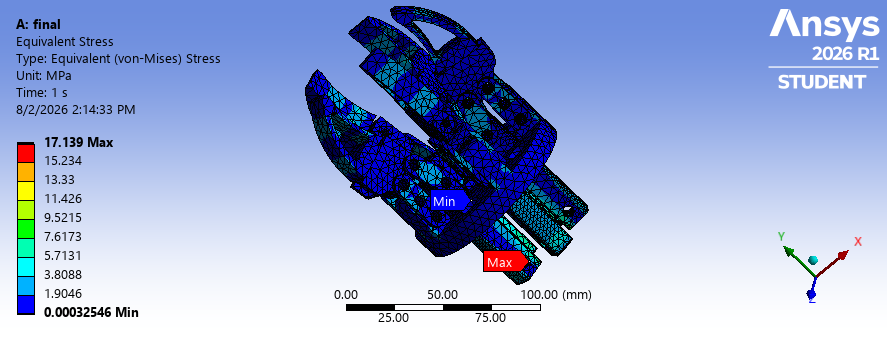
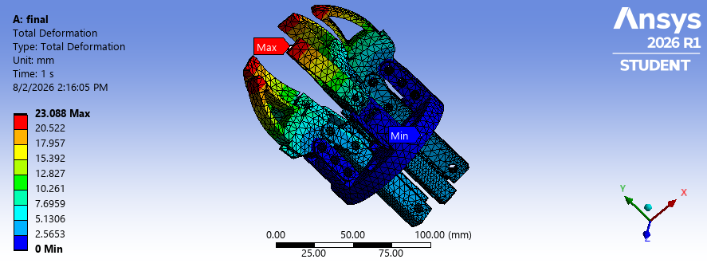
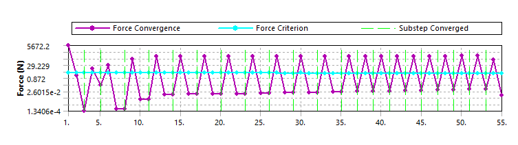

# 5-Jaw Radial Gripper — FEA (Ansys)

Static structural analysis of a 5-jaw radial gripper with central pushrod
(slider-crank) actuation, in Ansys Mechanical 2026 R1. This is an in-progress
study, preliminary results are reported below with their known limitations, and
the full write-up is in [`FEA-process-documentation.pdf`](FEA-process-documentation.pdf).

## The mechanism

Five jaws spaced at 72° are driven by a central pushrod through five crank links:
the pushrod moves axially and each crank rotates its jaw inward (closing) or
outward (opening) — a slider-crank. Roughly 150 mm from mounting flange to jaw tip,
with ~34 mm of pushrod travel between fully open and fully closed.

## Load case & mechanical advantage (from first principles)

No load spec existed, so one was built from the payload. For a 5 kg object held by
friction across 5 jaws, with a 3.0 safety factor and a 0.30 friction coefficient, the
required grip force per jaw is:

F_grip = (m · g · SF) / (μ · n)
       = (5 · 9.81 · 3.0) / (0.30 · 5)
       ≈ 98 N per jaw

Because the gripper is a slider-crank, the pushrod force needed to hold a given grip
force isn't constant across the stroke. Mechanical advantage is worst at the **fully
open** position, where the crank link sits perpendicular (90°) to the pushrod axis — so
it takes the most pushrod force there to resist a given jaw load. That's the worst-case
actuation point, and the position an actuator-sizing calculation should be run against.

To map this across the full stroke, an interactive linkage force calculator was built
from the linkage geometry (crank ~20 mm pin-to-pin, jaw pivot-to-link-pin ~14 mm, jaw
pivot-to-tip ~38 mm) to estimate mechanical advantage at each position and locate that
worst case. These dimensions are current estimates from a reference model and should be
replaced with exact CAD measurements before the numbers are treated as final.

The FEA itself was run at **50 N per jaw** as an initial test value (below the 98 N
target), applied radially outward at each jaw tip to represent the gripped object
pushing back. Fixed support on the mounting flange.

## Modeling approach & key decisions

- **Transient → Static Structural.** A locked-pushrod grip check has no meaningful
  inertia or time dependence, so the transient formulation was dropped in favor of
  static — faster and better-conditioned.
- **Two-step loading.** Step 1 closes the mechanism through its full stroke with
  forces off; step 2 applies the grip load with the linkage locked closed. Ramping
  displacement and force together (the original single-step setup) let the jaws swing
  open under load before the linkage engaged — the source of the unrealistic early
  deflection. Separating the two fixed it.
- **Convergence handling.** The solver's reference value was dropping near zero, so a
  minimum force-convergence reference of 50 N was set; large deflection kept on for
  the rotating linkage.

## Preliminary results — read the caveats

| Quantity | Value | Status |
|----------|-------|--------|
| Peak von Mises stress | ~17.2 MPa | **Singularity** at a sharp claw edge — a mesh artifact, not a design stress. Needs a fillet + mesh-convergence study. |
| Max total deformation | 23.1 mm | **Artifact** from an early single-step, −5 mm run where the linkage wasn't engaged. Two-step re-solve pending. |
| Force convergence | Oscillatory | Residual chattered (see plot) due to MPC over-constraint at the joints — not yet clean. |

Nominal stresses away from the singular edge are low relative to typical metal yield
(steel ~250 MPa, aluminum ~70+ MPa), so the part is not stress-limited — the real
open questions are joint modeling and closed-state stiffness.

## Known issues & outstanding work

- **MPC over-constraint** at the 16 revolute joints: with jaws at 72° there's no common
  rotation axis, so the default MPC revolute joints conflict and cause the convergence
  oscillation above. Results near the pin bores aren't yet trustworthy. **Planned fix:**
  replace the revolute joints with Augmented-Lagrange frictional cylindrical contacts,
  which allow rotation about the pin without needing a shared axis.
- Re-solve with two-step loading and confirm jaw-tip deflection under grip load
  (target < 0.5–1 mm for grip accuracy).
- Refine linkage geometry from exact CAD; fillet the singular edge; mesh-convergence
  study; then fatigue life, pushrod buckling, and pin bearing-stress checks.

## Material

_Material: steel
